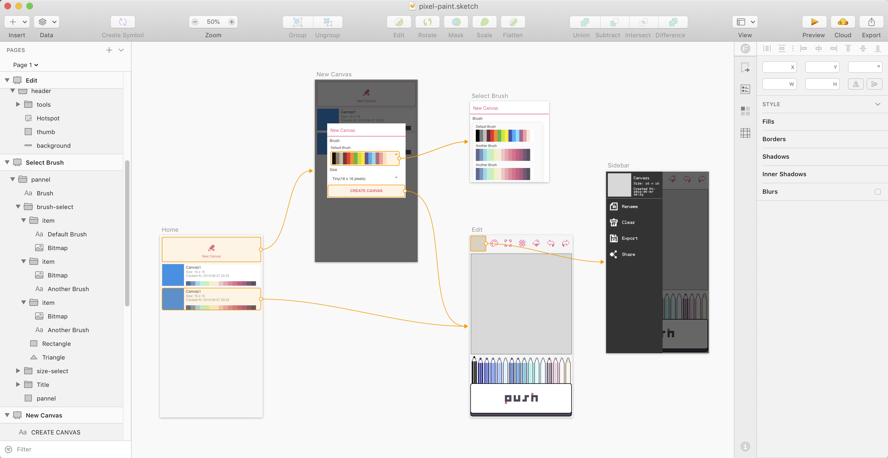
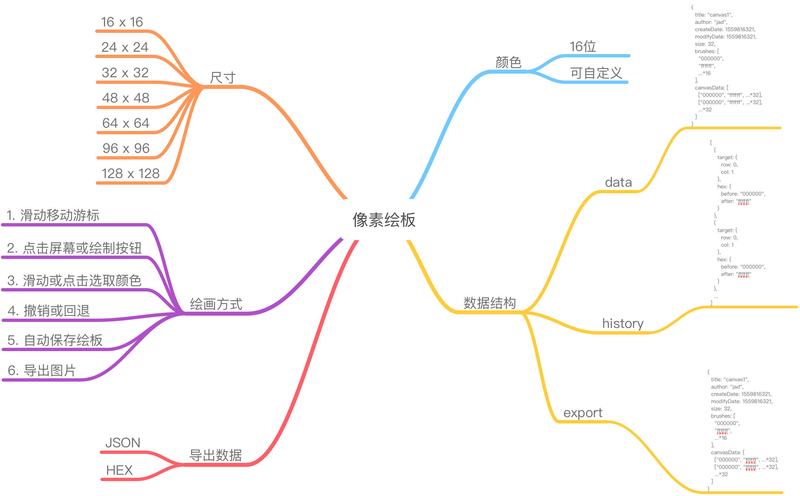

# 像素绘板

## 开坑中

*功能和界面参考[dotpict](https://play.google.com/store/apps/details?id=net.dotpicko.dotpict)*

[DEMO](https://journey-ad.github.io/pixel-paint)（非实时代码）


### 应用原型图



### 思维导图


## Project setup
```
yarn install
```

### Compiles and hot-reloads for development
```
yarn run serve
```

### Compiles and minifies for production
```
yarn run build
```

### Run your tests
```
yarn run test
```

### Lints and fixes files
```
yarn run lint
```

### Customize configuration
See [Configuration Reference](https://cli.vuejs.org/config/).
